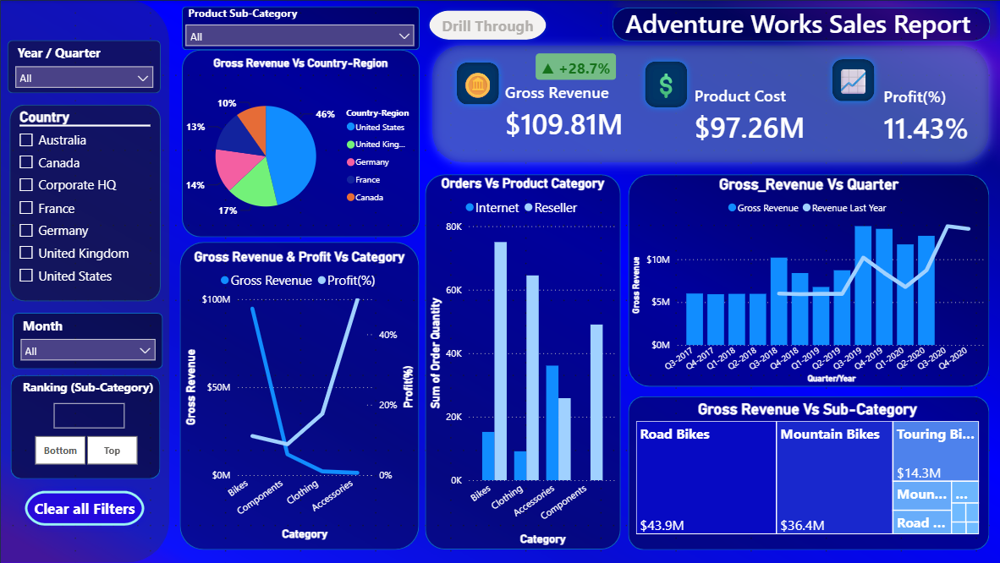

#  <p align=center> 🚀 AdventureWorks Executive Sales & Diagnostic Analytics Dashboard

**🌟 Executive Summary:** A production-grade, two-page interactive Power BI reporting package engineered to bridge the gap between high-level executive revenue monitoring and deep-dive product diagnostics.

## <p align=center> 📌 Table of Contents
* [***🎯 Project Overview & Objectives***](#-project-overview--objectives)

* [***🛠️ Technical Skills & Tools Showcase***](#️-technical-skills--tools-showcase)

* [***🤖 Strategic AI Collaboration (Synthetic Stakeholder & Co-Pilot)***](#-strategic-ai-collaboration-synthetic-stakeholder--co-pilot)

* [***📊 Dashboard Architecture & Visual Showcase***](#-dashboard-architecture--visual-showcase)

* [***💡 Key Business Findings & Executive Observations***](#-key-business-findings--executive-observations)

* [***🧮 Core DAX Calculations***](#-core-dax-calculations)

* [***🏁 Project Conclusion & Key Takeaways***](#-project-conclusion--key-takeaways)

---


## 🎯 Project_Overview & Objectives

* This project was developed as a hands-on learning initiative to build, test, and showcase end-to-end Power BI skills using Microsoft's AdventureWorks enterprise dataset. 
* The primary objective was to construct a production-grade, two-page interactive dashboard that balances high-level executive KPI tracking on the main board with granular sub-category diagnostic analysis on a drill-through page.

Throughout this project, Google Gemini was utilized as a technical peer reviewer, design auditor, and synthetic business stakeholder to simulate executive requirement gathering, audit UI/UX.

|**ADVENTUREWORKS REPORT** | |
|:---|:---|
| **PAGE 1: MAIN BOARD** | **PAGE 2: DRILL-THROUGH DIAGNOSTIC** |
| • Revenue & Profit Margin<br >• Regional & Channel Breakdown<br>• Dynamic Top/Bottom N Ranking | • Sub-Category Unit Economics<br>• Price Realization % Tracking<br>• Monthly Order Quantity vs. Profit |


## 🛠️ Technical Skills & Tools Showcase

- **🗄️ Power BI Desktop** - (Data Modeling, DAX, Drill-Through, Parameters, Dynamic Visual Titles)

- **🧮 Star Schema Modeling** - (Connecting Sales_Fact to Dimensions table)

- **🎨Data Transformation & QA** - (Date Sorting, Axis Label Formatting, Color Contrast Audit)

- **🔍 AI-Assisted Workflow** - (Requirements Scoping, Code Optimization, Layout Peer Review)


## 🤖 Strategic AI Collaboration (Synthetic Stakeholder & Co-Pilot)

To reflect modern data analytics workflows, Google Gemini was integrated across key development phases:

### 1. 👔 Synthetic Stakeholder Scoping
***Persona:*** Simulated an Executive Vice President of Sales.

**Impact:** 
- Extracted core Business Requirement Documents (BRDs) 
- Identified missing unit-economic metrics—specifically Price Realization % (to detect discount leakage) and Average Order Value (AOV) (to track basket size efficiency)

### 2. 🧮 DAX Debugging & Optimization
***Workflow:*** Authored all baseline DAX logic independently and utilized AI as a technical peer reviewer.

**Impact:** Help in Troubleshooting calculation context issues—specifically when handling tie-breaking logic in ```RANKX``` and dynamic disconnected parameter switching.

### 3. 🎨 UI/UX Quality Assurance Audit
***Workflow:*** Ran visual audits to catch front-end polish edge case issues to finalize the design.

**Impact:** Identified month-axis alphabetical sorting bugs (NOV → FEB → MAY), eliminated truncated labels (ex: Septem...).

## 📊 Dashboard Architecture & Visual Showcase

### 🗄️ Data Model & Star Schema Architecture

The dashboard relies on a star schema centered around a consolidated sales fact table connected to six dimension tables via 1-to-Many ($1:*$) relationships:

 

**Table Breakdown:** 

* ***Sales_Fact (Central Fact Table):*** 
    1. Contains transaction-level metrics including Extended Amount, Order Quantity, Product Standard Cost, Profit, and Profit%. 
    2. Key linkages include CustomerKey, OrderDateKey, SalesOrderLinkKey, ProductKey, ResellerKey, and SalesTerritoryKey.   

* ***Product_Dim:*** Provides product data such as Category, Subcategory, Product, Model, List Price, and Standard Cost.   

* ***Customer_Dim:*** Stores direct consumer details including Customer, Customer ID, City, State-Province, and Country-Region. 

* ***Reseller_Dim:*** Captures wholesale partner attributes including Reseller, Reseller ID, Business Type, City, State-Province, and Country-Region.   

* ***Sales_Order_Dim:*** Tracks order-line data including Sales Order, Sales Order Line, SalesOrderLineKey, and transaction Channel (Reseller vs. Internet). 

* ***Sales-Territory_Dim:*** Defines geographic sales across Country, Region, and broad territory Group. 
  
* ***Date_Table:*** Dedicated calendar dimension providing temporal attributes like Date, Day, Month, Month No (used for chronological sorting), and 3-Letter_Month. 

### 📈 Page 1: Main Board (Executive Overview)

 

 #### 🔍 Key Features:
- **🏆 Header KPI Cards:** Instant tracking for Gross Revenue, YoY Growth Badge, Product Cost, and Profit Margin % .

- **🎛️ Left Slicer Panel:** Global controls for Year/Quarter, Country, Month, dynamic Top/Bottom N ranking parameters, and a single-click Clear All Filters reset button.

- **📊 Gross Revenue & Profit(%) Vs Category:** A dual-axis combo chart pairing Gross revenue with relative profit efficiency.

- **🌲 Gross Revenue Vs Sub-Category:** A treemap visual instantly highlighting business volume concentration.

- **📈 Gross Revenue Vs Quarter:** Dual-axis line/column chart comparing quarterly gross revenue against prior-year benchmarks (Revenue Last Year).

- **⚖️ Orders Vs Product Category:** - Order volume breakdown across categories split by order fulfillment channel.

### 🔬 Page 2: Sub-Category Diagnostic (Drill-Through Page)


#### 🔍 Key Features:
- **🎯 Dynamic Header Banner:** - Dynamically renders the active drilled product category.

- **💰 Diagnostic KPIs:** - Tracks unit economics including Price Realization % , Average Unit Price, AOV, and Internet Sales Volume.
- **📍 No of Customers Region-wise:** - Displays customer distribution across territories.
- **📅 Gross Revenue & Average Order Value Vs Region:** -  Pairs regional revenue with unit transaction scale to highlight high-value buyer territories.
- **Order Quantity & Profit Vs Month:** Chronologically sorted line chart (JAN through DEC) tracking volume vs. profitability trends over time.

## 💡 Key Business Findings & Executive Observations

### ***Portfolio-Wide Volume vs. Profitability (Page 1 Macro Analysis):***

### 🚴 Volume vs. Margin Drivers:

- Bikes drive primary business volume ($43.9M in Road Bikes, $36.4M in Mountain Bikes) but carry lower profit percentages due to heavy manufacturing costs.

- Accessories generate lower absolute revenue but yield a massive ~40% profit margin.

### ***Sub-Category Diagnostic Insights (Page 2 Dynamic Analysis):***

    Note: Metrics on Page 2 dynamically update based on the specific sub-category selected during drill-through, such as Road Bikes. 

### 🏷️ Discount Control & Margin Leakage (Price Realization %):

- For high-value categories like Road Bikes, the Price Realization % sits at 68.75%, revealing an average discount or margin concession of 31.25% off standard list prices (MSRP).

- Sales leadership can use this metric to benchmark reseller channel discounting policies.

### 🌐 Regional Basket Efficiency:

- Drilling into individual sub-categories highlights whether revenue in major regions is driven by high order volume or higher unit transaction scale

- High revenue in major territories (e.g., United States) is heavily order-volume driven.

- Select international markets maintain higher Average Order Values ($2,100+), indicating smaller customer bases that purchase higher-value items per order.

### 📉 Monthly Profit Trajectory: 

Tracks if sales spikes for a selected sub-category bring healthy profits across the year or lose money to seasonal discounts.

## 🧮 Core DAX Calculations

### 1. Gross Revenuse & YOY Growth %

```sql
Gross_Revenue = SUM(Sales_Fact[Sales Amount])
```
```sql
Revenue_Last_Year = CALCULATE([Gross_Revenue], SAMEPERIODLASTYEAR(Date_Table[Date]))
```

```sql
YoY_Growth% = If([Gross_Revenue]>0,(DIVIDE([Gross_Revenue] - [Revenue_Last_Year], [Revenue_Last_Year],0)),"N/A")
```

### 2. Dynamic Top/Bottom Ranking Parameter
```sql
Top Bottom Rank Flag =  
If (
SELECTEDVALUE(Top_Bottom_Filter[Value])= "Bottom",
    RANKX(
        ALLSELECTED (Product_Dim[Subcategory]),
        [Gross_Revenue],,
        ASC,
        Dense
    ),

    RANKX(
        ALLSELECTED(Product_Dim[Subcategory]),
        [Gross_Revenue],,
        DESC,
        Dense
    )
)
```


```sql
Filter Condition = IF( '_Measure'[Top Bottom Rank Flag] <= 'Filter Count'[Filter Count Value],1,0)
```

### 3. Price Realization %

```sql
Price Realization % = 
VAR List_Price = SUMX(Sales_Fact, Sales_Fact[Order Quantity]* RELATED(Product_Dim[List Price]))
Return
DIVIDE([Gross_Revenue], List_Price, 0)
```

### 4. Average Order Value (AOV)

```sql
Average Order Value = 
DIVIDE([Gross_Revenue], DISTINCTCOUNT(Sales_Fact[SalesOrderLineKey]),0)
```

### 5. Average Unit Price

```sql
Average_Unit_Price = DIVIDE([Gross_Revenue],SUM(Sales_Fact[Order Quantity]),0)
```

## 🏁 Project Conclusion & Key Takeaways                          

- ***🎯 User-Centric Visual Design:*** Small UI refinements; Cleaning up technical database names, removing underscore clutter, and ensuring axis labels never truncate elevates the professional feel of a report.

- ***🔄 Context-Driven Analytics:*** Adding drill-through pages transforms a dashboard from a passive metric reader into an active decision-making workbench.

- ***🤝 Modern AI Workflow:*** Utilizing AI as an automated peer reviewer accelerates QA, validates mathematical logic, and refines layout design while keeping full technical ownership in my hands.

⭐ If you found this project helpful or inspiring, feel free to star this repository!
